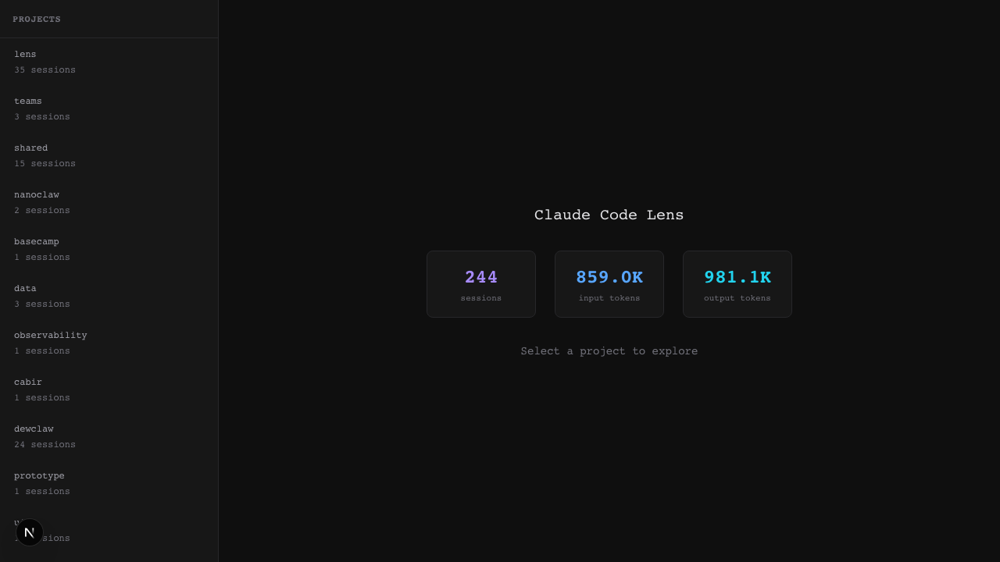

# Claude Code Lens

A local viewer for Claude Code sessions — browse conversations, inspect tool calls, and track usage.



## Features

- **Project browser** — scan and list all Claude Code projects with session counts
- **Session detail view** — two-panel UI with navigable message tree and full conversation content
- **Tool call inspection** — expandable tool calls with syntax-highlighted input/output
- **Thinking block viewer** — collapsible display of Claude's extended thinking
- **Search within sessions** — full-text search across messages with match count
- **Keyboard shortcuts** — Ctrl+T (toggle thinking), Ctrl+O (toggle tool outputs), Esc (reset)
- **Team session support** — teammate labels and protocol message rendering
- **Dashboard with global stats** — aggregate session count and token usage across all projects

## Prerequisites

- **Node.js** 18.18 or later
- **Claude Code** installed with session history in `~/.claude/projects/`

## Quick Start

```bash
git clone https://github.com/your-username/claude-code-lens.git
cd claude-code-lens
npm install
npm run dev
```

Open [http://localhost:3000](http://localhost:3000) to browse your sessions.

## How It Works

Claude Code Lens reads JSONL session files from `~/.claude/projects/` and presents them in a two-panel dark-themed UI. No database required — it reads directly from disk.

## Tech Stack

Next.js 16, React, TypeScript, Tailwind CSS.

## Project Structure

```
src/
├── app/              # Next.js App Router pages + API routes
├── components/
│   ├── dashboard/    # Project sidebar, session list, session cards
│   ├── session/      # Message tree, message content, tool calls, thinking blocks
│   └── ui/           # Shared UI components (filters, copy button)
├── hooks/            # React hooks for data fetching
└── lib/              # Backend logic (JSONL parser, project scanner, types)
```

## API Routes

| Route | Purpose |
|-------|---------|
| `GET /api/projects` | List all projects with session counts |
| `GET /api/sessions?project=<encodedPath>` | Sessions for a project |
| `GET /api/session/[id]` | Full parsed session with messages and tool calls |
| `GET /api/stats` | Global aggregate stats |

## Development

```bash
npm run dev       # Start dev server on port 3000
npm run build     # Production build
npm run lint      # Run ESLint
```

## License

[MIT](LICENSE)
