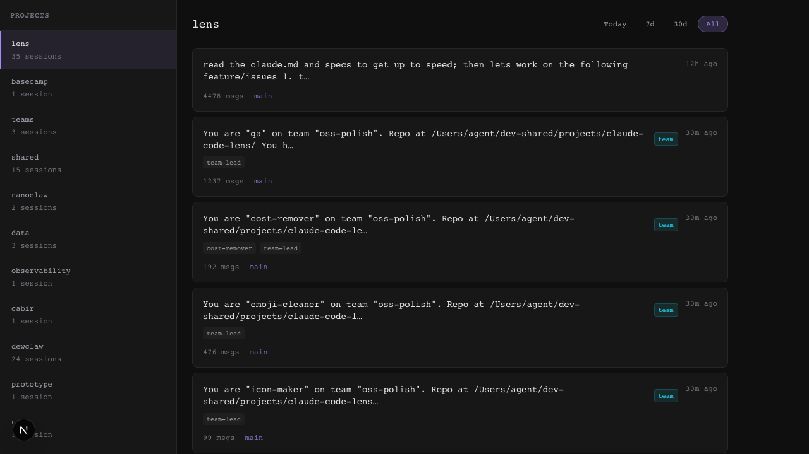
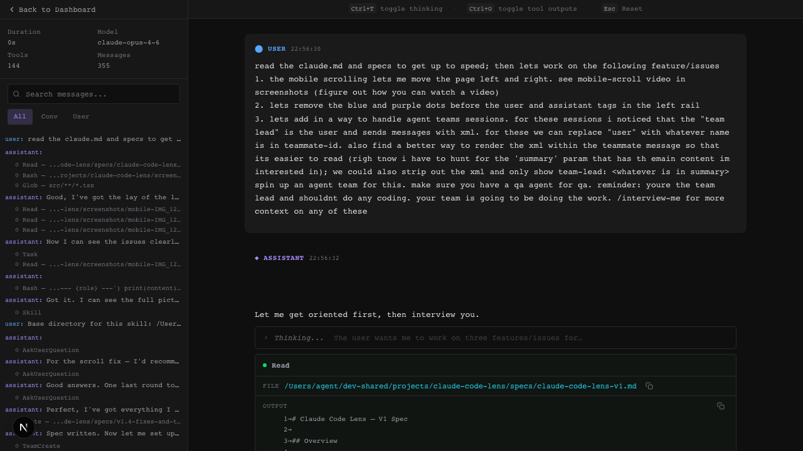

# Claude Code Lens

A local tool for seeing what Claude Code and Claude Agent SDK agents are actually. Renders the thinking, tool calls, messages, and session data in a scannable UI

## Why

I built this because I wanted to understand what my Claude Code agents were actually doing. The raw JSONL session logs have the agent thinking, tool calls, messages between teammates but they're unreadable. I was especially curious about agent teams: how do they coordinate? What are they saying to each other? Super fun feature and I wanted to reverse-engineer it to figure out how to take better advantage of it

Lens turns those logs into something browsable/readable. I use it to understand why the agent reaches for certain tools, spot patterns in how it reasons through problems, and study how teammates talk to each other. It started as tinkering and turned into something I use daily (makes for a good commute read)

## Inspiration

- **[Ben Tossell's Cookbook Session Viewer](https://cookbook.bensbites.com/cookbook/reverse-engineering-features/session/#msg-0)** — super nice UX. Dark theme, monospace terminal feel, two-panel layout with sidebar navigation and message content.
- **[Ralph Loop UI](https://github.com/bentossell/ralph-loop-ui)** — related to the cookbook, lightweight task dashboard approach.
- **[Claude Code Hooks Multi-Agent Observability](https://github.com/disler/claude-code-hooks-multi-agent-observability)** — hook-based event capture with timeline views. Data approach for future real-time monitoring and team observability.

## Features

- **Project browser** — scan and list all Claude Code projects with session counts
- **Session detail view** — two-panel UI with navigable message tree and full conversation content
- **Tool call inspection** — expandable tool calls with syntax-highlighted input/output
- **Thinking block viewer** — collapsible display of Claude's extended thinking
- **Search within sessions** — full-text search across messages with match count
- **Keyboard shortcuts** — Ctrl+T (toggle thinking), Ctrl+O (toggle tool outputs), Esc (reset)
- **Team session support** — teammate labels and protocol message rendering
- **Dashboard with global stats** — aggregate session count and token usage across all projects

## Screenshots

### Dashboard


### Project browser

Browse all your Claude Code projects and their sessions at a glance.



### Session detail view

Two-panel layout with a navigable message tree on the left and full conversation content on the right. Tool calls are rendered inline with expandable input/output blocks.



## Prerequisites

- **Node.js** 18.18 or later
- **Claude Code** installed with session history in `~/.claude/projects/`

## Quick Start

```bash
git clone https://github.com/your-username/claude-code-lens.git
cd claude-code-lens
npm install
npm run dev
```

Open [http://localhost:3000](http://localhost:3000) to browse your sessions.

## How It Works

Claude Code Lens reads JSONL session files from `~/.claude/projects/` and presents them in a two-panel dark-themed UI. No database required — it reads directly from disk.

## Tech Stack

Next.js 16, React, TypeScript, Tailwind CSS.

## Project Structure

```
src/
├── app/              # Next.js App Router pages + API routes
├── components/
│   ├── dashboard/    # Project sidebar, session list, session cards
│   ├── session/      # Message tree, message content, tool calls, thinking blocks
│   └── ui/           # Shared UI components (filters, copy button)
├── hooks/            # React hooks for data fetching
└── lib/              # Backend logic (JSONL parser, project scanner, types)
```

## API Routes

| Route | Purpose |
|-------|---------|
| `GET /api/projects` | List all projects with session counts |
| `GET /api/sessions?project=<encodedPath>` | Sessions for a project |
| `GET /api/session/[id]` | Full parsed session with messages and tool calls |
| `GET /api/stats` | Global aggregate stats |

## Development

```bash
npm run dev       # Start dev server on port 3000
npm run build     # Production build
npm run lint      # Run ESLint
```

## License

[MIT](LICENSE)
